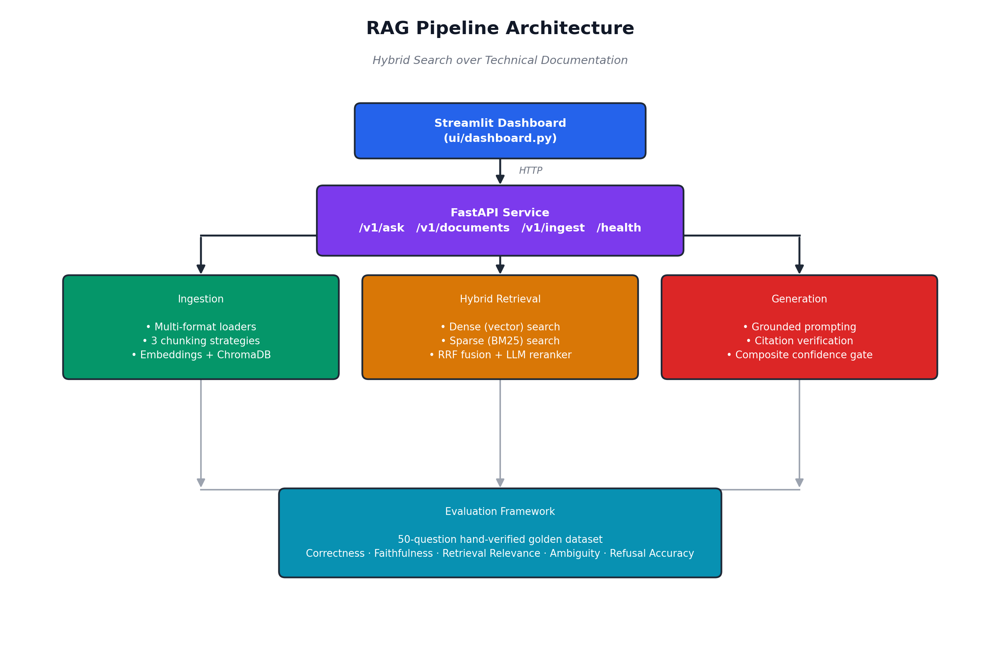

# RAG Pipeline with Hybrid Search Over Technical Documentation


A production-style Retrieval-Augmented Generation system built over FastAPI's official documentation. It combines dense vector search with sparse keyword search, reranks results with an LLM judge, generates citation-grounded answers, independently verifies every citation, and refuses to answer when it isn't confident enough — all validated against a hand-verified 50-question evaluation suite.

This isn't a quickstart wrapped around a single PDF. Every component below — chunking strategy comparison, hybrid retrieval, citation verification, confidence gating, evaluation — was built, tested, and in several cases debugged from a real, reproducible failure, documented as such rather than hidden.

---

## Table of Contents

- [What This System Does](#what-this-system-does)
- [Architecture](#architecture)
- [Tech Stack](#tech-stack)
- [Project Structure](#project-structure)
- [Setup](#setup)
- [API Reference](#api-reference)
- [Evaluation Results](#evaluation-results)
- [Known Limitations](#known-limitations)
- [Design Decisions Worth Knowing](#design-decisions-worth-knowing)

---

## What This System Does

1. **Ingests** 155+ real documentation files (Markdown, HTML, PDF-capable) into a unified schema
2. **Chunks** every document three different ways (fixed-size, structure-aware, semantic) so retrieval quality can be measured per strategy, not assumed
3. **Retrieves** using both dense embeddings and BM25 keyword search, fused with Reciprocal Rank Fusion, then reranked by an LLM judge
4. **Generates** answers strictly grounded in retrieved context, with inline `[1][2]`-style citations
5. **Verifies** every citation independently — the model's own citation claim is never trusted at face value
6. **Scores confidence** as a weighted composite of retrieval relevance, citation coverage, and answer completeness, and **refuses to answer** rather than hallucinate when that confidence is too low
7. **Evaluates itself** against a 50-question, hand-verified golden dataset spanning direct, multi-hop, ambiguous, and unanswerable questions

---

## Architecture



The dashboard and API are fully decoupled — the dashboard holds no pipeline logic of its own and communicates with the backend purely over HTTP, the same way any external client would. Ingestion, retrieval, and generation are independent modules that only meet inside the API layer, and the evaluation framework runs against all three without modifying any of them, so scoring never influences the system it's measuring.

---

## Tech Stack

| Component | Choice | Why |
|---|---|---|
| Language | Python 3.11+ | Ecosystem standard |
| LLM & Embeddings | OpenAI API (`gpt-4o-mini`, `text-embedding-3-small`) | Cost-effective, high quality |
| Vector Store | ChromaDB (embedded, file-based) | No server needed, persists to disk |
| Sparse Search | BM25 (`rank_bm25`) | Exact keyword matching, no server dependency |
| API | FastAPI | Async-native, automatic OpenAPI docs |
| Dashboard | Streamlit | Fast, functional frontend over the API |
| Containerization | Docker + docker-compose | One-command reproducible deployment |
| Testing | pytest | Fast, deterministic regression suite |

---

## Project Structure

```
rag-pipeline/
├── src/
│   ├── config.py                # Centralized settings, logging, thresholds
│   ├── ingestion/                # Loaders, 3 chunking strategies, embeddings, pipeline
│   ├── db/                       # ChromaDB wrapper
│   ├── retrieval/                # Dense, sparse, fusion, reranker
│   ├── generation/                # Prompting, citations, confidence, orchestration
│   ├── evaluation/                # Golden dataset, metrics, strategy comparison
│   └── api/                      # FastAPI schemas, routes, app entrypoint
├── ui/
│   └── dashboard.py               # Streamlit frontend
├── scripts/                      # CLI entry points + diagnostic tools used during development
├── tests/                        # Fast, deterministic regression tests (no API calls)
├── data/
│   ├── raw/                      # Source documents (gitignored)
│   ├── chroma/                   # Vector store persistence (gitignored)
│   └── eval/golden_qa.json       # 50-question hand-verified golden dataset
├── docker/Dockerfile
├── docker-compose.yml
└── requirements.txt
```

---

## Setup

### Prerequisites
- Python 3.11+
- An OpenAI API key
- Docker (optional, for containerized run)

### 1. Clone and configure

```bash
git clone <your-repo-url>
cd rag-pipeline
cp .env.example .env
```

Edit `.env` and add your real key:
```
OPENAI_API_KEY=sk-...
```

### 2a. Run locally

```bash
python3 -m venv .venv
source .venv/bin/activate        # Windows: .venv\Scripts\activate
pip install -r requirements.txt
```

Ingest the corpus (place documents in `data/raw/` first):
```bash
python -m scripts.ingest_corpus
```

Run the API:
```bash
uvicorn src.api.main:app --reload
```

In a separate terminal, run the dashboard:
```bash
streamlit run ui/dashboard.py
```

| Service | URL |
|---|---|
| API docs | http://localhost:8000/docs |
| Dashboard | http://localhost:8501 |

### 2b. Run with Docker

```bash
docker compose up --build
```

Same URLs as above. Indexed data persists across restarts via a mounted volume. To seed a fresh corpus inside the container:
```bash
docker compose run api python -m scripts.ingest_corpus
```

### 3. Run the test suite

```bash
pytest tests/ -v
```

Fast, deterministic, no API calls required — 15 tests covering chunking, citation verification, fusion ranking, and eval metrics, including regression tests written directly from real bugs found during development.

---

## API Reference

| Endpoint | Method | Description |
|---|---|---|
| `/v1/ask` | POST | Ask a question, get a grounded answer with citations and confidence scores |
| `/v1/documents` | GET | List all indexed documents with per-strategy chunk counts |
| `/v1/ingest` | POST | Trigger ingestion of a document directory |
| `/health` | GET | Liveness check |

Example request:
```bash
curl -X POST http://localhost:8000/v1/ask \
  -H "Content-Type: application/json" \
  -d '{"question": "How do I use BackgroundTasks in FastAPI?", "strategy": "structural", "retrieval_mode": "hybrid"}'
```

`retrieval_mode` accepts `hybrid` (dense + BM25 + rerank) or `dense_only`, letting you directly compare retrieval approaches on the same question — this same toggle is available live in the dashboard.

Full interactive documentation, generated automatically from the code, is available at `/docs` once the API is running.

---

## Evaluation Results

Every number below comes from a real, reproducible run against the 50-question golden dataset (`data/eval/golden_qa.json`) — 24 straightforward, 10 multi-hop, 8 no-answer, and 8 deliberately ambiguous questions, each hand-verified against the actual source documentation.

### Overall (structural chunking)

| Metric | Score |
|---|---|
| Answer correctness (straightforward + multi-hop) | **87.4%** |
| Faithfulness (citation coverage) | **92.6%** |
| Retrieval relevance | 80.6% |
| Refusal accuracy (out-of-corpus questions) | **100%** |
| Ambiguity handling | 58.8% |

### Chunking Strategy Comparison

| Strategy | Correctness | Faithfulness | Retrieval Relevance | Ambiguity | Refusal Accuracy |
|---|---|---|---|---|---|
| Fixed-size | 86.2% | **95.7%** | 77.0% | **66.3%** | 100% |
| Structure-aware | **87.4%** | 95.3% | 79.4% | 58.8% | 100% |
| Semantic | 85.9% | 91.3% | **81.7%** | 57.5% | 100% |

> **Finding:** at full 50-question scale, the three chunking strategies perform comparably overall, each with a small, distinct tradeoff — fixed-size chunking led on faithfulness and ambiguity handling, semantic chunking led on retrieval relevance. An earlier 15-question run had suggested semantic chunking was a clear winner; that gap disappeared once the evaluation set was expanded, which is itself a real, worthwhile finding: small eval samples can produce confidently wrong conclusions about system design choices.

---

## Known Limitations

**Multi-hop retrieval on topically distinct sub-questions.** Questions requiring information from two conceptually distant documents (e.g., *"how do middleware and background tasks interact?"*) sometimes retrieve heavily skewed toward one topic, since a single query embedding blends both concepts into one search rather than searching for each independently. This is a known, reproducible limitation confirmed across multiple evaluation runs, not a one-off failure. The standard fix — query decomposition, splitting a multi-hop question into separate sub-queries before retrieval — is documented as future work rather than implemented, to keep this evaluation phase's scope contained.

**Ambiguity handling is moderate, not strong (58.8%).** The system does not proactively ask clarifying questions; it either addresses one interpretation of an ambiguous question or, less consistently, acknowledges the ambiguity explicitly. This is an area with clear room for improvement.

**`allow_origins=["*"]` in CORS configuration** is appropriate for local/portfolio use but should be restricted to specific origins in any real production deployment.

---

## Design Decisions Worth Knowing

- **Three chunking strategies were built and stored side-by-side** (not just one chosen upfront) specifically so retrieval quality could be measured empirically rather than assumed — see [Evaluation Results](#evaluation-results) above.
- **The confidence gate runs before generation**, not after — a low-confidence query never reaches the (paid) generation call at all, which is both a cost optimization and a hallucination-prevention measure.
- **Citation verification is independent of generation** — the model's own citation is never trusted; every `[N]` is re-checked against the actual source chunk by a separate LLM judge call.
- **Ambiguous and unanswerable questions are scored on different metrics than straightforward ones** — an earlier version of the evaluation framework scored every question type against the same "correctness vs. golden answer" rubric, which unfairly penalized ambiguous questions (whose golden answer describes the ambiguity, not a single correct response). This was identified and fixed during development; the corrected framework scores each question type against what it can actually be fairly measured on.

---